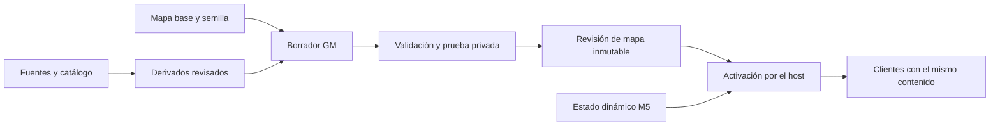

# Modo GM para construir el mundo

Fecha: 2026-10-10, hora de México. Estado: **GM01 implementado y verificado localmente en 0.6.0-alpha.18; sin publicación ni despliegue**. El alcance y evidencia de GM01 están en [docs/delivery/gm01-world-editor.md](docs/delivery/gm01-world-editor.md).

El objetivo es poder construir Salty Shore directamente en el juego: volar hasta una terraza, encontrar
un modelo por su imagen, colocarlo, moverlo, girarlo y probar cómo se recorre el lugar. Después se amplía
a materiales, conjuntos de objetos y edición del terreno. La biblioteca debe convertir las carpetas de
modelos y texturas en contenido fácil de encontrar y adecuado para jugar en navegador.

**Confirmado por el autor:** abrir el editor **dentro del juego, con borradores**. También es prioridad
reducir el peso de los modelos descargados con texturas 2K/4K conservando su apariencia tanto como sea posible.
Los originales se conservan; las optimizaciones producen derivados comparables y reversibles.

**Corte local ya implementado (GM01):** entrar al editor dentro del juego con capacidad GM en línea o en
modo local `?solo`, volar, colocar y transformar decoraciones nuevas, deshacer/rehacer y guardar, exportar
e importar un borrador local. El documento está separado del mapa base y del estado M5. Draft y recuperación
aislada usan IndexedDB del navegador con CAS; si la cuota impide guardar, hay fallback en memoria de sesión.
La recuperación conserva la revisión base y evita promover cambios sobre una revisión normal más reciente.
GM01 está verificado con 100/100 pruebas pertinentes (30 GM) y 13/13 comprobaciones de navegador con
autenticación simulada. La cuenta GM se provisionó y la allowlist privada está preparada, sin exponer su
identificador; falta despliegue y prueba positiva en producción. GM02 aún debe añadir edición de decoración
base y prueba caminando; publicar el diseño compartido será un corte posterior.

Las decisiones técnicas futuras siguientes son propuestas de implementación, sujetas a la revisión del autor.
Este plan continúa AREA01/AREA14 de la guía de áreas `PLAN-MASTER.md` del workspace compartido, no incluida
en el checkout aislado de primera entrega; respeta la autoridad M5 y las dependencias de
[PLAN-ALFA-MUNDO](PLAN-ALFA-MUNDO.md). El editor GM no sustituye la construcción del jugador.

## 1 Experiencia de edición

1. Desde la entrada o el menú, la cuenta autorizada abre **Editor del mundo / World editor**.
2. Elige el mundo y crea un borrador de su revisión publicada, o continúa uno guardado.
3. Vuela por el mapa, elige un asset de la biblioteca y ve su fantasma sobre el terreno.
4. Coloca, mueve, gira, escala, duplica o elimina; puede seleccionar objetos ya existentes.
5. Activa **Probar caminando / Walk test** en una sesión privada con la misma geometría y colisiones.
6. Regresa al editor conservando selección y cámara; guarda y revisa la lista de cambios.
7. Cuando exista publicación, prepara una revisión y solicita su activación. La interfaz muestra si está
   guardada, validada, esperando activación o realmente activa en el servidor.

La escena de edición usa el renderer y los assets del juego, con una instancia de borrador aislada.
Al entrar desde una partida se completa la salida y el guardado normal del personaje antes de cambiar
de modo. No se deja un cuerpo desatendido en combate. La cámara GM no es un personaje que vuela: no
obtiene botín, descubre progreso ni consume una plaza de jugador. La prueba privada usa estado descartable
y nunca escribe inventario, economía, obras, perlas o progreso en M5.

### Interfaz

| Zona | Contenido |
|---|---|
| Barra superior | Mundo, nombre del borrador, estado de guardado, deshacer/rehacer, probar, validar y publicación |
| Biblioteca izquierda | Buscar, categorías, favoritos, recientes, miniaturas y estado de preparación |
| Vista central | Mundo real, selección, manipulador de ejes, fantasma y motivo de colocación inválida |
| Inspector derecho | Nombre, posición, rotación, escala, apoyo, colisión, material y procedencia |
| Panel inferior plegable | Objetos/capas, historial y problemas; seleccionar un problema enfoca su ubicación |

Todos los textos nuevos se entregan en español e inglés según la regla de idioma de `AGENTS.md` (el documento
`PLAN-I18N.md` del workspace compartido no está incluido en el checkout aislado).
La edición inicial se diseña para teclado/ratón de escritorio. El mundo resultante conserva su soporte
móvil; un editor táctil completo es una entrega posterior. En pantallas pequeñas habrá mensaje y salida claros.

### Cámara y controles propuestos

Vuelo libre con botón derecho mantenido + ratón, WASD, Q/E para bajar/subir, Shift para acelerar y rueda
para ajustar velocidad. Al soltar el botón derecho, el cursor vuelve a los paneles. Añadir órbita alrededor
de la selección, enfoque con F, vista superior, volver a Salty Shore y marcadores de cámara.

Usar 1/2/3 para mover/girar/escalar, Supr para eliminar, Ctrl+D para duplicar y Ctrl+Z/Ctrl+Shift+Z para
deshacer/rehacer. Los campos de texto capturan sus teclas. Escape cancela primero el arrastre o la colocación;
después sale del modo activo. Perder foco libera botones. Los inputs de combate, balsa y cámara normal quedan
suspendidos mientras el editor posee el control. Los atajos son ajustables, no requisitos de gameplay.

## 2 Biblioteca que reúne los assets

La biblioteca tendrá un índice de archivos y sus relaciones; no requiere mover ni renombrar las fuentes.
Un escaneo de raíces permitidas y una actualización incremental detectarán novedades, duplicados por hash,
archivos desaparecidos y nuevas versiones. Una coincidencia de nombre no basta para declarar duplicado.

| Colección observada | Estado actual | Tratamiento propuesto |
|---|---|---|
| `assets/manifest.json` y `assets/models/` | 37 entradas: 16 model, 1 prop y 20 tex; 17 GLB | Base de contenido integrado; comprobar qué modelos son colocables |
| `materials/imported models/` | 8 GLB locales, 354.252.648 bytes en conjunto, fuera del manifiesto | Candidatos inmediatos para inspección, miniaturas y derivados optimizados |
| `tools/art-catalog/catalog.json` | Revisión 37, 110 filas de arte, referencias y evidencia | Reutilizar nombres, categorías, relaciones y estado de integración |
| `materials/references/` y `docs/art/` | Referencias, fuentes, previews y entregas | Separar imágenes de referencia de materiales utilizables |
| Inventario Unreal/FAB | Inventario previo de 7.406 archivos, en su mayoría paquetes fuente | Consultar candidatos y previews; exportación/preparación antes de uso web |

Los ocho GLB nuevos incluyen rocas, acantilado, dos árboles y coral; varios archivos rondan 59–62 MB.
Los recuentos son una observación de este checkout, no el inventario de un servidor publicado. Las fuentes
Unreal permanecen intactas y su inventario histórico no sustituye comprobar un candidato concreto.

La búsqueda debe aceptar nombres y etiquetas en ambos idiomas, categorías, pack/origen, formato, tamaño,
estado y uso en el mapa. Filtros principales: **Listos para colocar**, **Necesitan preparación** y
**Referencias/fuentes**. Los props procedurales existentes también deben aparecer como plantillas.

Cada ficha tendrá ID estable, nombre visible, miniatura, fuente y hash, versión del derivado, formato,
dimensiones reales, orientación/pivote, triángulos, materiales, texturas y resoluciones, bytes de descarga,
estimación de memoria, variantes de calidad y estado de revisión. Mostrará colisión disponible, tipo de
apoyo, restricciones y las instancias que lo utilizan. Los paths locales no se publican a clientes ordinarios.

Una textura se presenta como muestra/material, no como objeto 3D. PNG de referencia, GLB descargable,
GLB validado y modelo ya integrado tienen estados diferentes. FBX/OBJ/paquetes Unreal se incorporarán mediante
preparación externa cuando hagan falta; el navegador no convierte arbitrariamente todos los formatos.

El navegador recibe el índice preparado por una herramienta local o servicio autorizado; no puede explorar
por sí solo las carpetas del PC. Para editar desde el servidor, las miniaturas y los derivados elegidos deben
estar disponibles allí. Registrar una carpeta no significa subir su contenido completo.

## 3 Optimización con fidelidad visual

Esta es una condición de entrada de los nuevos modelos, no una limpieza al final del editor. Un archivo
pequeño puede consumir mucha memoria o producir demasiadas llamadas de dibujo. Se medirán por separado
descarga, geometría, texturas residentes, materiales, carga/decodificación y coste al repetir el asset.

### Originales y derivados

Mantener una fuente maestra inmutable con su hash. Cada receta de optimización fija versión de herramientas,
parámetros y hash de entrada; genera nuevos archivos y un informe antes/después. Repetir una receta parte
del original, evitando degradación acumulada. No se sobrescriben las descargas de 2K/4K ni se eliminan
duplicados automáticamente. El catálogo enlaza fuente, derivados, miniaturas y evidencia.

Primero inspeccionar dónde está el peso: imágenes incrustadas, número de materiales, geometría duplicada,
precisión de atributos, extensiones y animaciones. No aplicar una reducción porcentual idéntica a todos.
La inspección de estos ocho GLB arroja **10.835.817 triángulos**, 19 imágenes y 11 entradas de material
sumadas entre archivos. Aproximadamente **326,26 MB** corresponden a bufferViews de atributos/índices y
**27,97 MB** a imágenes incrustadas. Son bytes del archivo, no memoria residente medida. En seis modelos
domina la geometría: reducir únicamente 2K/4K no resuelve su peso ni su coste de dibujo.

| Modelo fuente | MB decimales | Triángulos | Texturas observadas | Problema principal |
|---|---:|---:|---|---|
| `Tropical_Rock_Formation.glb` | 8,84 | 19.469 | 3 de 2048² | Texturas, 8,08 MB |
| `geometric glowing tree.glb` | 5,76 | 17.883 | 1 de 4096² | Textura, 4,45 MB |
| `colorful coral reef 3d model.glb` | 61,74 | 2.000.696 | 3 de 4096² | Geometría, 58,85 MB |
| `gnarled+tree+3d+model.glb` | 58,67 | 1.949.387 | 1 de 2048² | Geometría, 57,12 MB |
| `mossy rock 3d model.glb` | 40,07 | 1.129.052 | 4096², 512² y dos de 256² | Geometría, 35,36 MB; cuatro materiales |
| `rock+formation+3d+model.glb` | 59,75 | 1.889.690 | 1 de 2048² | Geometría, 58,38 MB |
| `rocky+cliff+3d+model.glb` | 59,89 | 1.940.304 | 3 de 2048² | Geometría, 58,32 MB |
| `rocky+surface+3d+model.glb` | 59,52 | 1.889.336 | 3 de 2048² | Geometría, 56,16 MB |

Pilotos propuestos: `Tropical_Rock_Formation` para texturas y `colorful coral reef` para una malla muy densa
con detalle fino. El árbol luminoso sirve como comprobación adicional de albedo 4K. Si la reducción del coral
necesita trasladar detalle de geometría a normal map, hornear sobre una malla simplificada y comparar antes
de aceptar; compresión Meshopt por sí sola no reduce sus dos millones de triángulos. Conservar UV/materiales
cuando sea posible y revisar por separado cualquier cambio de topología o bake.

Hay una dependencia concreta para ese bake: `worldToon()` consulta `entry.toon.normal`, pero el contrato
actual de manifiesto no conserva ese campo. Además, el consumidor aplica una fuerza de normal de 0,6 y
no traslada roughness/metalness/AO ni todos los efectos PBR; `prepStatic` retira tangentes. GM00 debe verificar
el soporte de normales y sus convenciones antes de basar el ahorro en ellas, y especificar el cambio mínimo
de contrato/consumidor si hace falta. No basta con marcar una opción en el asset o revisar el resultado en Blender.
Comparar tres estados: fuente en visor de referencia, fuente sin optimizar en el juego y derivado en el juego.
Así se identifica qué diferencia viene de la adaptación de materiales y cuál de la optimización.

### Orden del procesamiento

1. **Limpieza conservadora:** quitar datos realmente no usados, deduplicar recursos idénticos y conservar
   UV, normales, transparencias, material, escala y pivote. Comprobar que animaciones/variantes no dependan
   de los elementos que se retiran.
2. **Compresión de geometría:** evaluar Meshopt con el loader existente. Distinguir compresión de bytes de
   cuantización y simplificación: estas últimas pueden cambiar la apariencia. Fijar tolerancias por asset.
3. **Texturas:** probar compresión y resolución por canal, comenzando con el detalle necesario en pantalla.
   Conservar sRGB para color y tratamiento lineal para normales/máscaras. Mantener alfa, mipmaps y bordes
   sin halos; no aplicar compresión de color de forma ciega a normales o canales empaquetados.
4. **Geometría para distancia:** crear LOD solo cuando aporte ahorro, conservando silueta, ramas finas,
   huecos y costuras UV. Comparar transición entre niveles. Reducir polígonos no reemplaza reducir draw calls.
5. **Repetición en el mapa:** compartir geometrías/materiales e instanciar copias compatibles; agrupar por
   sector para culling. Los materiales únicos por instancia tienen un coste que mostrará el editor.

La herramienta candidata es glTF Transform, cuyos pasos de inspección, deduplicación, compresión,
resolución y simplificación pueden ejecutarse por separado; su propia documentación advierte que los
valores automáticos no sirven igual para todas las escenas. Fijar una versión al implementar y revisar
sus resultados con nuestro loader. [Documentación oficial](https://gltf-transform.dev/cli).

### Resolución según uso

| Uso | Punto inicial de comparación, no límite universal |
|---|---|
| Utilería pequeña o repetida | 1024 escritorio y 512 móvil; subir si la comparación pierde detalle reconocible |
| Roca/árbol/edificio grande y cercano | Probar 2048 escritorio y 1024 móvil frente al original |
| Pieza protagonista o superficie extensa | Conservar 2K/4K donde se justifique; estudiar tiling/material de detalle antes de multiplicar mapas grandes |
| Vista de biblioteca | Miniatura ligera; cargar el modelo seleccionado bajo demanda |

El tamaño de la pieza en pantalla, su distancia habitual, la densidad de texel y el encuadre de vuelo GM
guían la elección. El editor puede solicitar una vista de mayor calidad explícita; el juego carga solo
la variante elegida, sin descargar primero el original. Las variantes mantienen dimensiones, pivote y
colisiones iguales. La resolución de textura y el LOD geométrico son decisiones independientes.

Como referencia de cálculo, una textura RGBA8 sin compresión GPU, con cadena completa de mipmaps,
ocupa aproximadamente **85,3 MiB a 4096²**, **21,3 MiB a 2048²**, **5,3 MiB a 1024²** y **1,3 MiB a 512²**.
Es una estimación por textura, no una medición de VRAM; varios mapas por material suman. PNG/JPEG/WebP
reducen transporte, pero su tamaño de archivo no representa ese coste residente.

Propuesta en dos pasos: usar derivados compatibles con el pipeline WebP actual y evaluar **KTX2/Basis**
para reducir también memoria de texturas. KTX2 requiere integrar loader, transcoder, selección según GPU,
fallback y comprobación del toon shader; servir un archivo `.ktx2` no demuestra soporte. El registry actual
configura Draco/Meshopt pero no KTX2. Probar calidad por canal, tiempo de transcodificación y formato final
en los dispositivos objetivo antes de adoptarlo. [KTX2Loader oficial](https://threejs.org/docs/pages/KTX2Loader.html).

### Aceptación visual y de rendimiento

Comparar original y derivado con la misma cámara, escala, iluminación y tratamiento de materiales: vista
próxima, distancia de juego, silueta, día/noche y giro lento. Usar A/B y recortes al 100 % para color,
detalle, alfa, normales, costuras y parpadeo al alejarse. Separar una diferencia causada por optimización
de una causada por la adaptación toon; el loader actual transforma materiales y convierte modelos a estáticos.

Cada asset registra tamaño original/final, ahorro, triángulos, materiales, resoluciones reales cargadas,
estimación residente, tiempos y capturas. El preset inicial es automático; los casos con pérdidas visibles
suben calidad o cambian de receta. Una métrica numérica de imagen puede detectar regresiones, pero no acepta
por sí sola la apariencia. No prometer un porcentaje de reducción ni pérdida cero antes del piloto.

Como referencia existente, el importador avisa sobre archivos de más de 15 MB y geometría por encima de
6.000 triángulos para `prop` o 40.000 para `model`; son avisos históricos, no presupuesto total del mapa.
GM00 fijará presupuestos medidos para el rincón de prueba, con coste de varias copias visibles. Carga,
memoria y frame time se compararán en hardware identificado. La emulación móvil verifica UI y derivados,
pero no certifica FPS de un teléfono real.

## 4 Colocar y editar modelos

La colocación usa intersección con el terreno real o una superficie de apoyo seleccionada, nunca solo
un plano a la altura del personaje. El fantasma muestra huella, orientación, altura y validación antes del clic.
Modo continuo para repetir una pieza; Escape cancela. Solo el gesto confirmado crea una operación de historial.

El manipulador permite traslación XYZ, giro XYZ y escala uniforme, con ejes locales/globales y valores numéricos.
Predeterminar giro sobre Y para edificios y permitir inclinación en decoración. Snap ajustable de posición,
ángulo y escala; propuestas iniciales de posición 0,25/0,5/1 m y giro 5/15/45 grados. Incluye apoyar base,
offset vertical, alinear opcionalmente a la normal, mantener vertical y restablecer transformación.

Separar transformación de importación, pivote de autoría y transformación de instancia para no aplicar dos
veces el fit/rotY actual. Guardar posiciones en metros y orientación canónica; la interfaz muestra grados.
Escala positiva finita y acotada por tipo. Escala no uniforme y espejo quedan para después por sus efectos
en normales, winding, colisiones y presupuesto visual.

Seleccionar por clic, jerarquía o búsqueda; mostrar contorno, nombre e ID. En grupos fusionados/instanciados
se selecciona el objeto lógico, no el chunk completo. Al arrastrar, una representación temporal responde
inmediatamente; al confirmar se actualizan solo los grupos afectados. Cancelar restaura el estado anterior.

La primera versión incluye duplicar, borrar, ocultar en el editor, bloquear selección y deshacer/rehacer.
Ocultar para trabajar y quitar del mundo son acciones distintas. Multiselección, grupos, prefabs y pincel de
dispersión siguen después. Una operación compuesta se deshace completa; mover durante un segundo no crea
60 entradas. Deshacer un borrador nunca revierte silenciosamente una revisión publicada.

## 5 Colisiones y objetos con función

| Tipo de objeto | Regla de edición propuesta |
|---|---|
| Decoración | Transformación libre válida; sin efecto sobre inventario o servicios |
| Obstáculo estático | Plantilla de colisión validada; render y simulación usan la misma transformación |
| Superficie caminable | Requiere soporte de suelo y límites propios; un GLB no crea un puente transitable automáticamente |
| Recurso recolectable | Vincula aspecto, nodo, collider e identidad; edición funcional posterior |
| NPC, banco, obra, mercado, spawn, zona | Ancla de gameplay protegida hasta disponer de un adaptador específico |
| Construcción/barco de un jugador | Estado dinámico de gameplay; fuera de los cambios de decoración |

El motor actual usa principalmente círculos XZ para colisión estática. La primera entrega ofrece
decoración y obstáculos con un proxy circular simple por objeto; muestra la huella y
rechaza transformaciones que el proxy no pueda representar correctamente. No asignar un enorme círculo
a una casa con entrada y llamarla transitable. Cajas orientadas, interiores, puentes y plataformas necesitan
un corte de colisión/superficies común a movimiento y proyectiles antes de habilitar esas plantillas.
También los conjuntos de colliders por objeto necesitan propiedad y transformación explícitas antes de
ofrecerse como plantilla compuesta; la lista actual de círculos no implementa por sí sola ese contrato.

Las palmeras recolectables, anclas de servicios, muelle, llegada, arena/boss y PvP aparecen seleccionables
con su restricción, pero inicialmente bloqueadas para mover/borrar. La biblioteca puede colocar una copia
decorativa de un árbol; no la convierte implícitamente en una fuente de madera. La fase funcional permite
mover nodos conservando identidad y estado, con reglas explícitas sobre recolección y ocupación.

Validar accesos y pendientes del recorrido principal, puertas, radios de interacción, spawn/checkpoints,
muelle, agua navegable y áreas protegidas. El borrador puede mostrar intersecciones intencionales entre rocas;
los errores que bloquean publicación son los que rompen contratos funcionales, límites o dependencias.

## 6 Datos del mapa y compatibilidad

Mantener el generador actual como base, completar primero su RNG y S21, y después aplicar una capa de
autoría: adiciones, transformaciones, sustituciones y eliminaciones explícitas. El renderer y la simulación
consumen el mismo mapa compilado; el editor nunca guarda objetos Three.js como fuente de verdad.

| Registro | Contenido mínimo propuesto |
|---|---|
| Documento de mapa | Versión de esquema, worldId/mapId, semilla, versión/hash de generador base, bounds y revisión padre |
| Instancia | ID estable, assetId + versión/hash, posición, orientación, escala, apoyo/offset y plantilla de colisión |
| Override base | ID del objeto generado, operación y valores; huella de su definición original para detectar cambios |
| Borrador | ID, revisión optimista, autor, mapa base, operaciones/checkpoints, fecha de guardado y validación |
| Revisión publicada | Contenido inmutable, hash, dependencias exactas de assets, compatibilidad del runtime y resultado de validación |
| Activación | Mundo destino, revisión esperada/solicitada, autor, operación idempotente y resultado confirmado |

Los props actuales no tienen ID general: se necesita una tabla de identidad de la base, ligada a semilla
y revisión, sin consumir RNG. Para el primer mapa puede mapearse índice original + huella a un ID persistente,
pero un cambio de generador exige migración explícita. No reordenar ni compactar arrays heredados al borrar.
Las eliminaciones se representan con marcas; instancias nuevas obtienen sus propios IDs fuera de la simulación.

Conservar también la propiedad de cada collider: algunos pertenecen a prácticas/armeros, no a props.
Recompilar el índice espacial tras editar no puede descartar esos obstáculos independientes. Los recursos
se congelan como catálogo de la base antes de aplicar decoración: regenerarlos sobre props alterados puede
cambiar nodos aunque sus IDs parezcan estables. Recurso y prop asociado se migran juntos cuando se habiliten.

Un cambio de generador/asset mientras existe un borrador se muestra como conflicto de base. Rebase con
comparación y resolución explícita, nunca aceptar por casualidad el mismo índice o nombre de archivo.
Assets usados por revisiones activas o recuperables se conservan aunque el catálogo tenga versiones nuevas.

## 7 Borradores permisos y publicación

**Guardar** conserva el diseño. **Validar** comprueba contenido y recorrido. **Publicar** prepara una revisión.
**Activar** cambia la revisión utilizada por el mundo. La interfaz debe distinguir estas consecuencias,
aunque el flujo pueda agrupar publicar y solicitar activación con un resumen de cambios.

**Implementado en GM01:** autoguardado del documento local y recuperación separada al salir de forma forzada o
recargar con cambios; exportación/importación JSON validada, con IDs y referencias, sin rutas absolutas ni
credenciales. IndexedDB guarda por navegador, cuenta y mundo; CAS por revisión detecta dos pestañas en
conflicto y no sobrescribe la versión más reciente. La recuperación guarda la revisión base esperada y su
limpieza también usa CAS. Si falla una escritura por cuota, el fallback en memoria solo dura la sesión actual.
Esto no es almacenamiento durable del servidor ni se presenta como guardado remoto. La persistencia online,
backup y recuperación remota siguen pendientes de GM03.

GM01 permite varios contextos locales, con control de revisión para que otra pestaña detecte conflicto y
no sobrescriba silenciosamente. La colaboración simultánea en línea, cursores compartidos y mezcla de
cambios quedan fuera hasta diseñar una autoridad compartida.

### Identidad y almacenamiento

**Implementado en GM01:** `GET /api/gm/session` verifica la identidad resuelta por el autenticador existente
contra la lista explícita `GM_ACCOUNT_IDS` y solo concede la capacidad `gm-editor`. La ruta no concede
administración general ni poder de escritura en el servidor: los borradores solo se guardan en IndexedDB y
no existe endpoint remoto de guardado/publicación. Parámetros de URL, invitados y `DEV` no conceden permiso.
La evidencia de navegador alpha.18 empleó autenticación simulada; la suite seleccionada pasó 100/100 pruebas
pertinentes, incluidas 30 GM, y el recorrido de navegador 13/13 comprobaciones. Los tests locales del endpoint
verifican bearer, allowlist y rechazo. La cuenta GM fue provisionada y la allowlist privada está preparada,
pero no se ha desplegado ni verificado el permiso positivo en producción. GM03 debe autorizar cada operación
durable/publicación, mantener `DEV=0` y definir registro y recuperación antes de ofrecerlas.

GM01 usa IndexedDB local, con clave separada por navegador/cuenta/mundo y CAS. La propuesta futura de
persistencia online sigue sin implementar: evaluar el almacenamiento durable existente para documentos
de borrador y revisiones inmutables, con tablas de contenido separadas de perfiles/economía y acceso por
servicio autorizado. GM03 debe diseñar migración, permisos, backup y recuperación. Un borrador solo podrá
marcarse durablemente guardado tras recibir confirmación del almacenamiento remoto.

Los derivados aprobados se distribuyen inicialmente con los assets de la release, usando nombres/hash
inmutables. La preparación local sincroniza índice y derivados por ese flujo; un asset aún no disponible
en la release no se ofrece como colocable online. Al crecer la biblioteca, los blobs pueden trasladarse
a almacenamiento de objetos sin cambiar IDs ni contratos. No hay conversión pesada dentro del tick o VPS
de juego. El contenedor actual es de solo lectura y `/tmp` es efímero: no almacenar ahí borradores.

El contenido estático y los borradores tienen almacenamiento propio; M5 conserva el estado de jugadores,
economía, obras y demás sistemas que ya gobierna. El host es el único que activa el mapa. La persistencia
de borradores no autoriza al editor a escribir directamente filas de gameplay.

La revisión activa se registra como referencia de contenido del mundo, bajo su dueño M5 y control de
versión, con valor por defecto equivalente al mapa actual. Los documentos inmutables no tienen otro
puntero activo competidor. GM03 extiende/sanea ese contrato con su dueño y prueba la migración antes de uso.

### Activación inicial

Primero probar la revisión en sandbox. Para el mundo compartido, preparar assets y contenido inmutables,
validar compatibilidad con el runtime activo y esperar a que el host esté vacío, sin sockets de juego ni
operaciones durables pendientes. Coordinar la exclusión con el actualizador del VPS para impedir dos cambios
a la vez. Detener/admitir sesiones y activar mediante un único procedimiento del host; no hacer hot edit en v1.

Añadir revisión/hash de contenido al contrato de admisión: cliente y servidor deben cargar el mismo mapa
antes de crear el personaje. La semilla por sí sola ya no basta. Si faltan archivos o la revisión no coincide,
se informa y se evita entrar con colisiones diferentes. Revisar PROTOCOL_VERSION al introducir el contrato.
El renderer puede usar un fallback aprobado, pero conserva la definición de colisión del contenido activo.

Antes de activar, comprobar posiciones guardadas, checkpoints, barcos, nodos y demás estado dinámico afectado.
Bloquear revisiones incompatibles o ejecutar una migración específica recuperable; no borrar progreso ni
reubicar posesiones silenciosamente. La activación debe tolerar fallo/reinicio entre preparación y cambio
del puntero activo y devolver el mismo resultado al reintentar una solicitud ya aplicada.

Conservar revisiones anteriores para rollback. Restaurar un mapa no restaura dinero, inventarios ni recibos
antiguos; necesita la misma comprobación de compatibilidad con el estado dinámico actual. Confirmar la revisión
realmente activa, salud y entrada de dos clientes antes de declarar publicado. Hasta GM03, la UI no ofrece
una publicación operativa. Edición en vivo ocupada requiere después otro diseño de aplicación por tick,
ocupación y sincronización; no es un interruptor añadido a este flujo.

## 8 Materiales conjuntos y herramientas de productividad

Tras el recorrido básico: multiselección, grupos, duplicación múltiple, alinear/distribuir y prefabs de rincón
de puerto, puesto de mercado o conjunto de rocas. Cada prefab conserva IDs por instancia y transformaciones
relativas; actualizar la plantilla no cambia automáticamente todas las copias publicadas.

El inspector de materiales ofrece variantes preparadas por ranura, color y tiling dentro de parámetros
admitidos. Cambiar una instancia no modifica el material compartido de todas las demás. Mostrar el coste
de romper la instanciación. Reutilizar las familias de arena, madera y suelo existentes antes de generar arte.

Pincel de dispersión posterior: radio, densidad, pendiente, altura, separación, semilla y rangos de rotación/
escala. Guardar las instancias resultantes y la receta, con un solo undo por trazo. Evitar recursos, caminos,
servicios y zonas bloqueadas. La aleatoriedad de autoría queda fijada; no depende del frame o Math.random
dentro de la simulación.

## 9 Edición y ampliación del terreno

El terreno actual es un heightfield: una altura por coordenada XZ, de 560 unidades con rejilla 561 × 561.
Es apropiado para elevar/bajar, aplanar, suavizar y formar rampas o islas. Cuevas, túneles y voladizos necesitan
geometría/superficies adicionales; no se obtienen con un pincel de altura.

**Primer corte de terreno:** subir/bajar, aplanar a una cota escogida, suavizar y crear rampa entre dos puntos,
con tamaño, intensidad, caída del pincel, vista previa y undo por trazo. Después pintura de materiales con
máscaras y caminos. Conservar el nivel global del mar; modificarlo afecta navegación y merece otro corte.

Guardar deltas o tiles de alturas sobre una base versionada, con muestras canónicas/cuantización definida,
checkpoints y hashes. El historial de pinceles ayuda a editar; no debe ser la única representación que todos
los clientes tengan que reproducir indefinidamente. La compilación es determinista, sin leer reloj o GPU.

Cada cambio reconstruye lo afectado: sampler/groundAt de simulación, malla y normales visibles, textura de
altura usada por el agua, máscaras de materiales/costa, minimapa, bounds y colocaciones apoyadas. La malla
visible y el heightfield usan resoluciones diferentes hoy: comprobar concordancia en crestas y rampas, no
solo que ambos parten de la misma función. No desplazar muelles/flotantes como si fueran props en tierra.

Propiedades de apoyo explícitas: pegado al terreno, altura absoluta, superficie concreta o flotante.
Mantener offsets al reproyectar; advertir sobre casas suspendidas, puertas enterradas, recursos bajo agua,
pendientes imposibles y rutas cerradas. Las áreas funcionales siguen protegidas hasta migración específica.

**Añadir tierra dentro de los bounds:** levantar el fondo y revisar costa, agua y accesos en el mismo mapa.
**Ampliar los bounds:** definir un nuevo dominio, océano exterior, muestreo y bordes; adaptar cámara, minimapa,
colisiones y navegación. Mantener coordenadas e identidades del área previa. Agrandar una rejilla cuadrada
tiene coste cuadrático; sectores/tiles y carga por región se evalúan para expansiones posteriores, sin
condicionar el editor inicial ni prometer un mundo infinito. Cruza [cartografía](docs/delivery/cartography.md)
y A3/A8 de [PLAN-ALFA-MUNDO](PLAN-ALFA-MUNDO.md).

## 10 Arquitectura de implementación propuesta

| Área | Base existente y cambio necesario |
|---|---|
| Entrada y ciclo de modo | `src/main.js`, `src/core/input.js`, `src/render/camera.js`: montar/desmontar editor bajo demanda y restaurar controles |
| UI y herramientas | Módulos nuevos bajo `src/editor/`: cámara, biblioteca, selección, inspector e historial; reutilizar patrones de `src/ui/raftEditor.js` |
| Assets | `src/render/assets/registry.js`, `manifest.js`, `tools/import-asset.mjs`, catálogo actual: índice y preparación separados de la carga masiva |
| Contratos de contenido | Módulos puros nuevos, compartidos por herramientas/cliente/host: validación, IDs, capas, compilación y hashes |
| Mapa | `src/sim/worldgen.js`, `terrainRevamp.js`, `src/data/resources.js`: seam posterior a generación, base estable y adaptadores funcionales |
| Render de instancias | `src/render/props.js`, `vegetation.js`, `resourceNodes.js`: relación ID lógico → representación y actualización por sector |
| Colisiones y terreno | `src/sim/systems/movement.js`, `src/sim/world.js`, `src/render/terrain.js`, `water.js`: datos compartidos y actualización consistente |
| Guardado y permisos | Servicio de contenido nuevo con auth existente; coordinar `server/host.mjs`, `server/worldState.mjs` y admisión, sin duplicar M5 |

Para el manipulador, evaluar el `TransformControls` de **Three.js r160**, la versión que usa el juego.
Ya proporciona modos de traslación/rotación/escala y snap; integrar selección e historial propios. No actualizar
todo Three.js solo por el editor. [Fuente oficial fijada a r160](https://github.com/mrdoob/three.js/blob/r160/examples/jsm/controls/TransformControls.js).

Separar catálogo de carga: el registry actual descarga todas las entradas antes de construir la escena.
Agregar miles de candidatos al manifiesto haría crecer la descarga inicial. El catálogo del editor carga
miniaturas por páginas y modelos bajo demanda; el mapa publicado declara solo sus dependencias. Liberar previews,
listeners y recursos sin invalidar geometrías/texturas compartidas. Evitar reconstruir la isla completa al arrastrar.

## 11 Entregas y aceptación

| Corte | Resultado visible y alcance | Prueba que permite cerrarlo |
|---|---|---|
| GM00 | Cuatro candidatos de optimización local: roca 2K/1K y coral 200K/50K triángulos; originales intactos | [Comparación visual local](docs/art/gm00/visual-review.md) con loader real, 14 capturas y dos ángulos; roca 1K casi idéntica, coral 200K mantiene silueta/color con pérdida de detalle fino, 50K se ve más facetado. Sin rendimiento físico móvil ni aceptación gameplay; recibo conserva `visualReview: pending` |
| GM01 | **Implementado y verificado localmente en alpha.18:** entrada GM, vuelo, catálogo inicial, fantasma, colocación de decoraciones nuevas, transformaciones, snap/apoyo, historial, recuperación aislada y borrador local | [Informe local](docs/delivery/gm01-world-editor.md): suite pertinente 100/100 (30 GM), navegador 13/13; setup de cuenta incluido. Autenticación de navegador simulada. Cuenta y allowlist privadas preparadas; despliegue/permiso positivo de producción pendientes |
| GM02 | Selección y edición de decoración existente, proxies compatibles y prueba caminando | Recorrido/colisiones en borrador aislado sin tocar M5; edición del mapa base bien delimitada |
| GM03 | Persistencia online durable, publicación controlada, contenido versionado, permisos para operaciones de escritura y recuperación | Invitado rechazado; host y dos clientes coinciden; fallo/reintento/rollback conservan progreso; revisión activa verificada |
| GM04 | Grupos/prefabs, materiales por instancia, dispersión y adaptadores funcionales por tipo | Editar un conjunto; mover un recurso conserva su estado/ID; plantilla transitable solo tras aceptar colisiones/superficies |
| GM05 | Esculpir/pintar terreno existente con deltas y reconstrucción coordinada | Rampa caminable, agua/minimapa coherentes, undo exacto y zonas protegidas preservadas |
| GM06 | Nueva tierra/islas y ampliación del dominio | Bordes y rutas continuos, identidad previa conservada, presupuestos medidos y admisión coherente |

**Orden:** GM00 produjo cuatro candidatos; ya tienen comparación visual registrada, pero no están aceptados para gameplay.
GM01 ya permite construir un borrador local de decoraciones nuevas; GM02 + GM03 siguen siendo necesarios
para editar la base y usar revisiones en el servidor compartido. No esperar a terreno, prefabs, multiedición
o todos los assets para continuar construyendo el rincón.
La ampliación del terreno se diseña ahora para que el formato la admita y se implementa después.

Antes de cada corte, verificar base/upstream y archivo dueño: `src/main.js`, protocolo, manifiesto y host
son puntos compartidos. Un escritor por archivo. Las rutas nuevas de la tabla son propuestas, no archivos creados.
GM02 fijará el alcance de la edición de geometría existente y del recorrido caminando. GM03 concreta
persistencia durable, autorización de publicación y la referencia activa con el dueño M5.

## 12 Matriz de comprobación

- **Recorrido de autor:** entrar, volar, buscar, colocar, seleccionar, transformar, deshacer, guardar, reabrir,
  probar caminando y volver; foco en inputs, Escape, pérdida de foco y error de carga sin perder el trabajo.
- **Datos y determinismo:** ida/vuelta del documento, valores inválidos, IDs duplicados, asset ausente, versión
  incompatible, mismos mapas/colliders por hash y base no alterada; conservación de nodos heredados.
- **Guardado y seguridad:** cuenta sin permiso, permiso revocado, revisión vieja, dos pestañas, respuesta perdida,
  reinicio durante guardado/activación y solicitud repetida. Sin aceptar URLs/rutas arbitrarias del cliente.
- **Juego:** ruta de Salty Shore, pendientes, puertas, recursos y radios de interacción; controles normales al
  salir, construcción/balsa/comercio/perlas intactos y prueba privada sin ganancias persistidas.
- **Visual:** original/derivado en encuadres iguales, miniaturas coherentes, selección correcta en instancias,
  high/mobile/low y fallback; inspeccionar capturas, no solo generarlas.
- **Rendimiento:** tiempo de abrir editor, miniaturas y primer modelo, bytes, memoria estimada/medida donde sea
  posible, triángulos/draw calls, frame times y liberación tras varios ciclos; comparar varias copias y cambios de calidad.
- **Publicación:** contenido accesible, runtime compatible, host vacío y drenado, una autoridad activa,
  dos clientes y entrada tardía con revisión correcta, rollback compatible sin revertir economía.

No se ejecutan estas pruebas por redactar el plan. Cada corte registrará implementación, evidencia local,
aceptación visual y publicación por separado, con el siguiente paso concreto.

## 13 Base revisada y decisiones pendientes

Revisión de planificación: checkout `claude/loving-lovelace-ptbif7`, HEAD observado `e967fb1`; upstream y
PR #1 observados en `ec5d054`. Hay trabajo concurrente sin commit. Las observaciones técnicas proceden del
árbol leído y del contraste selectivo con upstream; no se ha cambiado de rama ni actualizado ese trabajo.

Referencias de continuidad: [HANDOFF](docs/HANDOFF.md), [ASSETS](docs/ASSETS.md),
[catálogo de arte](tools/art-catalog/README.md), [terreno S21](docs/delivery/map-revamp-v1.md),
[inventario Unreal](docs/research/unreal-assets/SUMMARY.md), [portabilidad](docs/research/unreal-assets/PORTABILITY.md),
[editor de balsa D05](docs/delivery/d05-raft-editor.md), [VPS](docs/DEPLOY-VPS.md).
El código actual prevalece sobre notas históricas que todavía describen el manifiesto como vacío.

Quedan por cerrar en los briefs, sin cambiar la dirección confirmada: presupuesto y dispositivo de referencia,
recetas de los pilotos, esquema/permisos del almacenamiento propuesto, plantillas iniciales de colisión y
cuentas con permiso. Recomendación: autor como único GM inicial, escritorio para editar, assets estáticos preparados y
decoración existente primero, publicación con mundo vacío y terreno por fases.

Fuera de esta primera entrega: moderación/ban, regalar oro o items, poderes de combate, editor de rigs,
IA de generación, marketplace/UGC, terreno voxel y edición colaborativa en vivo. Pueden usar contratos
compatibles después, pero no hacen falta para comenzar a construir Salty Shore desde el juego.
