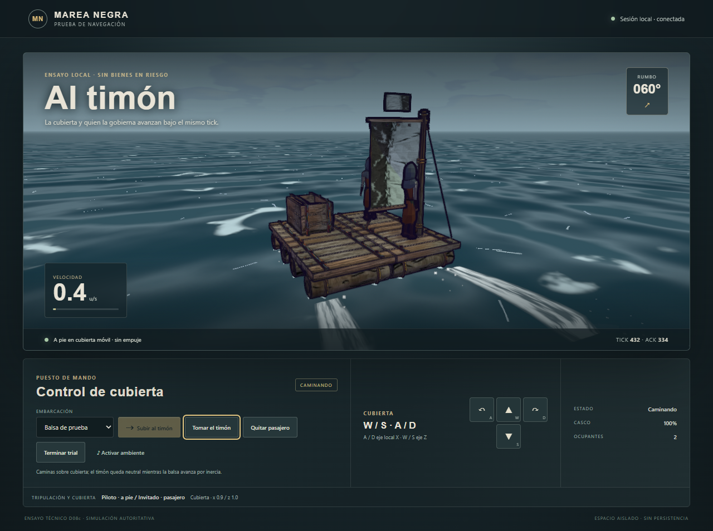

# D08c.3 — caminar sobre la nave y llevar pasajeros

2026-10-07. Implementado y verificado en el ensayo local de `PROBAR-PILOTAJE.cmd`.
Continúa [D08c.2](d08c2-pilot-deck.md); [contrato de este corte](../briefs/d08c3-relative-crew.md).
El juego ordinario sigue sin activar navegación. La copia del casco, sus HP y las posiciones del
ensayo son efímeros: no trasladan la bodega real ni cambian el plano guardado.

## Resultado

El propietario alterna entre timón y caminar con el nuevo botón. Soltar el timón cancela cualquier
empuje pendiente; la balsa continúa por inercia, sin órdenes de avance/giro mientras caminas.
Perder foco frena también en este modo. Retomar el timón conserva la posición alcanzada sobre cubierta.

Un invitado debe estar físicamente en cubierta, recibir permiso del dueño y aceptarlo desde su propia
sesión. La autoridad permite hasta tres pasajeros además del propietario. El harness crea un segundo
cliente local mediante «Crear pasajero», separado por colas clonadas; sirve para observar al invitado
sobre la misma balsa y retirarlo. No equivale a una conexión entre equipos por Internet.

La caminata reutiliza `stepMover` y `RaftDeck` en coordenadas del barco. Paredes, huecos, escaleras y
niveles mantienen sus reglas; las posiciones se transforman con la pose de la nave después de su paso.
El cliente predice su caminata y el dueño su propio casco. Tripulantes remotos y nave se interpolan
juntos; un pasajero no predice órdenes de timón ajenas. No hay balanceo visual independiente bajo los pies.

El protocolo sube a **18**: ejes locales `DECK_INPUT`, ACK/epoch privados separados y anclas públicas
`crew`. La validación del snapshot confirma ambos estados privados juntos. Paquetes viejos, sesiones
recicladas y comandos terrestres no pueden convertirse en otra autoridad sobre el personaje.
Las invitaciones expiran en 600 ticks. Entrada coalescida y timeout se aplican en el tick admitido;
un heartbeat durante una retención de M5 conserva el último estado/ACK confirmado.

Salir restaura el amarre y devuelve a la tripulación al muelle. Un pasajero puede retirarse por separado;
desconexión, cambio de fuente, muerte y pérdida de soporte invalidan la unión pertinente. El rescate
no revive ni concede bienes. Un ocupante no registrado sigue cerrando el ensayo local.

## Comprobación

- **21 pruebas nuevas:** locomoción 4, predicción de cubierta 5, autoridad de tripulación 7 y cliente 5.
  Incluyen paredes/huecos, escaleras en cuatro orientaciones, entradas malformadas, flood/timeout,
  invitación/consentimiento, pasajeros múltiples, salida/desconexión, replay, epochs, aceptación atómica
  y volver a caminar en el hueco de una pared rota sin modificar el plano guardado.
- **384/384** de regresión final integrada sobre el código de `2651957`: archivo de `0379b2e` más el
  delta M5 commiteado, con las 40 suites pertinentes anteriores, las cuatro nuevas, snapshot canónico
  y limpieza de inputs M5. Cero fallos, canceladas u omitidas. No incluye el arte concurrente.
- **Cuatro escenarios de navegador aceptados:** escritorio 1280×800, móvil emulado 390×844 y 844×390,
  más caseta de 29 piezas en escritorio. Montaje, invitación/aceptación, giro, caminata, blur, retomar
  timón, salida y conservación. Entradas táctiles confiables llegaron al handler real del UI.
- Posiciones autoritativas/locales/remotas comprobadas contra el marco de la nave; conservación de
  ambos perfiles y el amarre; sin cuerpos de prueba residuales, overflow, errores JS/activos ni WebGL.
- Ocho capturas inspeccionadas. Chrome headless con SwiftShader: prueba de integración y composición,
  sin aceptación de FPS, teléfono físico, red WAN ni escucha del audio en dispositivo.

La primera pasada de navegador encontró listeners de los dos botones sin conectar y una URL móvil
incorrecta del script; se corrigieron antes de la pasada aceptada. La revisión también corrigió el
frenado al perder foco caminando y alineó la interpolación visual del invitado con la pose del dueño.
El fixture de predicción compartía una matriz mutable; sus snapshots ahora clonan el plano.
La revisión final alineó la validación al volver a caminar con las piezas operativas, evitando que
la colisión de una pared rota siguiera bloqueándolo. Se comprobó por regresión de autoridad; la pasada
visual no aplica daño interno y precede a ese ajuste. El contacto costero todavía es el corte siguiente.

[Evidencia y hashes](d08c3-relative-crew-evidence.json),
[resultado completo del navegador](d08c3-relative-crew/evidence.json).

## Capturas

[Móvil vertical](d08c3-relative-crew/mobile-portrait-390x844-ui-v1.png) ·
[Móvil horizontal](d08c3-relative-crew/mobile-landscape-844x390-ui-v1.png) ·
[Caseta](d08c3-relative-crew/desktop-1280x800-house-ui-v1.png).

## Reutilización y siguiente corte

Luna revisó los tres clips Manny concretos del proyecto Survival; sus `.uasset` y rig no aportan una
animación exportada compatible con Three. Se reutilizaron el personaje procedural y las reglas de
movimiento existentes, así como renderer/material/agua/espuma/audio, sin nuevas texturas ni peticiones.
Rutas y tamaños en el [brief](../briefs/d08c3-relative-crew.md). Las fuentes Unreal permanecen intactas.

Sigue **contacto costero y HP modular en el puente autoritativo**. La barrera de esquinas todavía es
discreta y devuelve al muelle; no aplica el choque/daño continuo del laboratorio de manejo.
La pérdida de soporte tras romper piezas deberá conservar esta autoridad de tripulación.

El corte no añade combate/abordaje, saltos/dash, lastre humano, producción o editor durante navegación,
helm físico, riesgo persistente ni viajes públicos. Materiales/skill y límites finales de tripulación
conservan sus milestones. M5/D09 siguen siendo puerta de bienes, pérdidas, reparación y recuperación;
el playtest conjunto del autor queda reservado como acordó.
