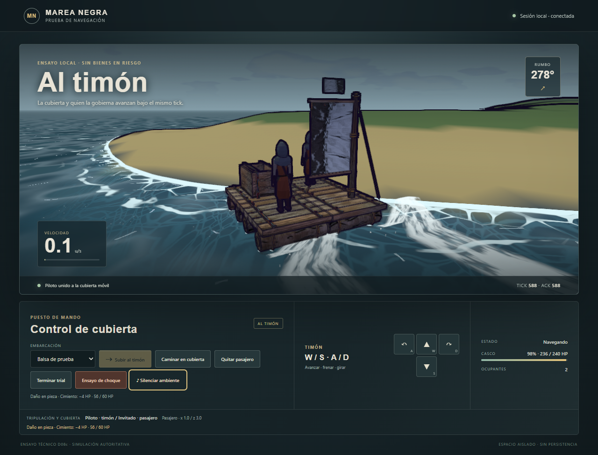

# D08c.4 — contacto costero y HP por pieza

2026-10-07. **Implementado y aceptado por checks automáticos en el ensayo local.**
[Contrato](../briefs/d08c4-coastal-hull.md). El juego ordinario continúa sin navegación pública.

## Comportamiento

La balsa toca la costa, el muelle y el borde del mapa mediante barrido de sus cimientos vivos.
Un impacto fuerte frena, rebota ligeramente y daña la pieza que chocó; el roce conserva deslizamiento
y la presión en reposo no resta HP repetidamente. La rotación usa una envolvente conservadora;
no es una simulación exacta de cuerpos rígidos. Máximo cuatro contactos por cuerpo/tick.

HP e identidad pertenecen a cada instancia del ensayo. Una pieza destruida desaparece del rig y
de la cubierta operativos. Se recalcula masa/centro sin desplazar el origen del plano. El exceso
de daño no pasa a otro bloque; una unión de triángulos tampoco multiplica daño en el mismo tick.
El huésped que pierde soporte vuelve al muelle. Si el propietario pierde soporte o toda flotación,
termina ese ensayo y se rescata a los ocupantes vivos. No se revive a muertos.

World y predicción usan la misma geometría del mapa. ACK/replay pueden cruzar destrucción sin
repetir HP ni feedback. El servidor emite impactos privados después de confirmar todos los cuerpos;
el harness deduplica la recepción de dueño/pasajero para compartir un splash y sonido en esa pantalla.
El protocolo sube a **19**; snapshots publican casco y HP por instancia durante el ensayo.

`PROBAR-PILOTAJE.cmd` añade **Ensayo de choque**, costa/muelle del mapa y barra de casco.
La preparación coloca una balsa nueva de prueba en agua y elige un corredor libre del muelle;
no añade un comando de teleport al juego. A partir del montaje se conservan su pose ECS fuente,
ambos perfiles, plano y bodega. No se persiste daño, ni se concede reparación o materiales.

## Validación

**437/437 pruebas pertinentes, 52 archivos**, cero fallos/cancelaciones/skips, Node v24.14.0,
concurrencia 1, 213,8 s. Archivo fijo `155390a` más runtime/test del montaje M5 `14ede6d` y
23 fuentes propias con SHA256 normalizados iguales al entorno aislado. Las ediciones posteriores
del host y el arte/puerto del checkout compartido quedan fuera de esta aceptación.

Cubren franjas de costa atravesadas en un tick, giro, roce y rebote/deslizamiento, muelle/borde,
IDs/HP/rebase, seam sin daño duplicado, destrucción durante ACK/replay, snapshots atómicos,
heartbeat retenido, soporte roto, rescate y conservación. La aproximación natural con W alcanza
daño de terreno en ambas fixtures sin cruzar el muelle ni inyectar velocidad.

**Cuatro recorridos de navegador aceptados:** escritorio 1280×800, móvil emulado 390×844 y
844×390, más caseta de 29 piezas en escritorio. Montaje, invitación/aceptación, choque,
HP público, splash/audio programado, salida y conservación exacta de perfiles/pose fuente.
Las dos vistas móviles usan toques CDP en el handler real y comprueban el eje de avance.
Cero errores JS/activos/WebGL, overflow o cuerpos residuales. Ocho capturas inspeccionadas.
Chrome headless/SwiftShader prueba integración y composición; no FPS, teléfono físico, red WAN
ni escucha del audio en un dispositivo. Los contadores prueban el disparo del splash; las capturas
posteriores no congelan el instante exacto del impacto.

Se corrigieron antes del cierre dos defectos del QA: el toque horizontal quedaba fuera del viewport
tras abrir audio, y la ruta de la caseta tocaba el muelle antes de la playa. Se añadió la comprobación
del eje real y del corredor completo, con regresión de impacto natural contra terreno.

[Evidencia y hashes](d08c4-coastal-hull-evidence.json) ·
[Resultado completo del navegador](d08c4-coastal-hull/evidence.json).

[Móvil vertical](d08c4-coastal-hull/390x844-impact-v1.png) ·
[Móvil horizontal](d08c4-coastal-hull/844x390-impact-v1.png) ·
[Caseta](d08c4-coastal-hull/1280x800-house-impact-v1.png).

## Reutilización y límites

Se verificaron los assets concretos de impacto de madera, spray y audio de agua de MyProject.
Niagara y `.uasset` no ofrecen aquí un derivado web exportado; se reutilizan pools de espuma/spray,
audio sintetizado, renderer/material de balsa y caja existentes. Rutas y tamaños en el contrato.
No se añaden texturas ni se modifican fuentes Unreal. La malla costera sin texturas es una fixture
acotada de 4.608 triángulos en escritorio y 1.152 en móvil; no sustituye el trabajo visual del puerto.

Este corte conserva el ensayo efímero: no activa navegación en `src/main.js`, Worker ni GameHost,
ni introduce combate, reparación, riesgo de carga o pérdidas durables. Los coeficientes de choque
son provisionales. El playtest conjunto del autor, el balance, la escucha y el rendimiento físico
permanecen abiertos.

Sigue delimitar **D10: primera travesía y encuentro NPC**, con rutas seguras/riesgosas y maniobras
de huida. La activación pública necesita cableado de entrada/cámara y los contratos durables M5/D09
para bienes y recuperación. El montaje trusted del host no completa por sí solo esa activación.
