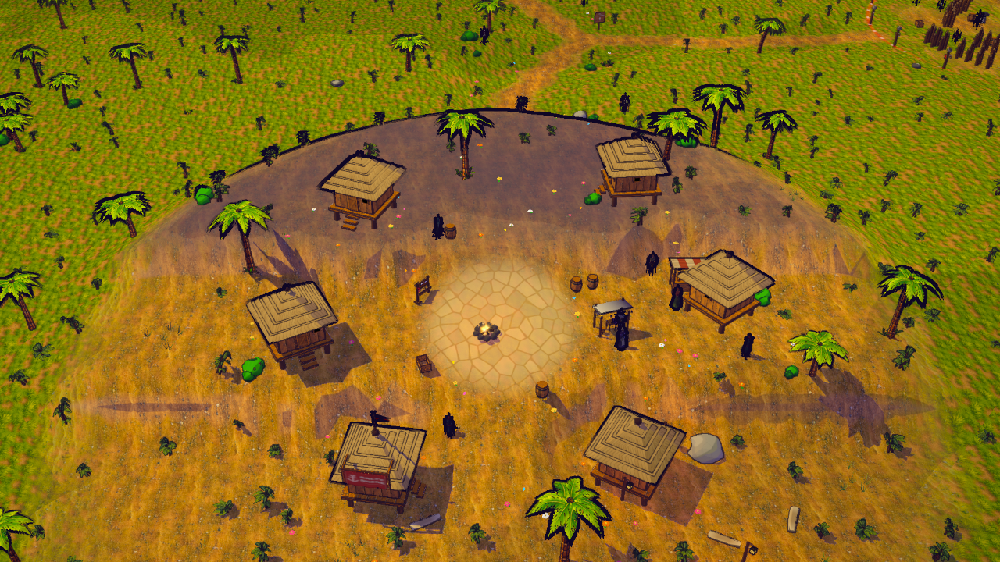

# S21 — isla ampliada y pueblo en terrazas

Entrega local del 2026-10-08, autorizada por el autor para modificar únicamente el terreno. La isla conserva sus edificios, vegetación, recursos, muelle, volcán, jefe y Cala Calavera. El pueblo gana tres niveles con rampas; dos extensiones conectadas dejan espacio para crecimiento posterior.

## Resultado espacial

La cuadrícula pasa de 400 × 400 a 560 × 560 unidades, con resolución de simulación de 1 unidad. Para la semilla de juego `99282957`, el muestreo cada 2 unidades de terreno sobre cota 0,65 aumenta la superficie seca **63,148347 %**. El componente conectado a la llegada cubre el **100 %** de las muestras sobre cota 0,2. Estas son medidas espaciales; no son una prueba de rendimiento ni certifican que cada pendiente sea caminable.

El pueblo tiene terrazas a 2,4 / 6,4 / 10,4 unidades. Una rampa central y transiciones laterales conectan los niveles. Las seis casas conservan sus huellas y orientación, con apoyos planos. Los objetos suben o bajan siguiendo el terreno y conservan su separación original respecto al suelo; muelle, postes, barcos y flotadores mantienen su soporte anterior.

Se conserva el suelo del jefe, su portón, el volcán y cráter, la fortaleza PvP y la llegada. Sus centros, radios, colisiones, enemigos, NPC, checkpoints y reglas no cambian. Las calas con decoración submarina mantienen agua en torno a sus anclas existentes. Dos pasos suaves de terreno conectan el interior de las extensiones, sin objetos de puente. La tierra nueva queda sin objetos añadidos en este pase. No crea Puerto Sol, otra población, encuentros ni rutas comerciales nuevas.

## Compatibilidad

`src/sim/terrainRevamp.js` transforma el terreno después de terminar la generación y las tiradas de RNG anteriores. Se retiene el mapa fuente para conservar las decisiones de colocación de palmeras, arbustos, hierba, conchas, restos y algas; se ajusta su altura al suelo nuevo.

La comparación congelada confirma **1.259 props** con igual orden, identidad y campos salvo Y. Cambian 227 alturas de props. Los **176 nodos de recursos** conservan identidad, orden y XZ: 96 palmeras, 69 piedras y 11 troncos. Cambian 51 alturas de recursos; el banco conserva su lugar. Las partidas mantienen sus coordenadas XZ y los puntos de aparición calculan Y con el terreno actual. No se modifican esquemas persistidos ni SQL.

El panel M usa un alcance de 255 unidades en el marco de la cámara, frente a 185, y dibuja la isla ampliada con sus marcadores. La versión local es `0.1.0-alpha.15`, protocolo **31**: cliente y host necesitan recargar/reiniciar juntos para evitar mezclar revisiones de terreno. No se añadieron campos al protocolo de snapshots ni reglas de gameplay.

## Coste medido

| Medida | Antes | Después |
|---|---:|---:|
| Cuadrícula CPU actual | 643.204 B, N401 | 1.258.884 B, N561 |
| Cuadrículas CPU retenidas en total | 643.204 B | 1.902.088 B |
| Triángulos dibujables de terreno | 47.882 | 64.136 |
| Atributos + índices de terreno GPU | 2.807.332 B | 4.891.272 B |
| Textura de altura de agua | 256², 131.072 B | 256², 131.072 B |

La malla visual usa 320 subdivisiones (1,75 unidades), mientras la simulación sigue muestreando a 1 unidad. Los cambios high → low → medium → high reutilizan geometría y textura de altura. No se añaden texturas, modelos ni draw calls de objetos. Los bytes anteriores no contabilizan toda la memoria del juego; son buffers identificados en la evidencia.

## Verificación

- **220/220 pruebas** seleccionadas, en 37 archivos, sin fallos, omisiones ni cancelaciones. Incluyen navegación real con colisiones desde la llegada hacia cinco NPC, dos racks, el banco, la entrada del jefe, la entrada de Cala y ambos interiores nuevos; estabilidad de recursos, cosecha, balsas, red y familias visuales.
- La primera propuesta tenía franjas de agua que impedían llegar a la tierra nueva a pie. Se conservaron sus fuentes/capturas como borrador y se corrigieron los dos pasos de terreno. La aceptación final recorre 171 / 109 aristas hasta sus destinos con subpasos de movimiento de hasta 0,15 unidades, sin atravesar colisiones ni cambiar las reglas de movimiento.
- **30 capturas**: cinco vistas antes en escritorio y cinco vistas después en escritorio, móvil emulado, low, retrato y modo sin assets. Vistas: pueblo, isla completa, volcán, jefe y PvP.
- **20 comprobaciones posteriores de cambio de calidad**, sin reconstruir los buffers de terreno/altura. No son capturas adicionales.
- Sin errores JS de página, juego, carga de assets, GL o enlace de programas en esos casos. La consola registra únicamente el 404 previo de `favicon.ico`.
- **Dos capturas adicionales del mapa M**, escritorio y móvil: abrir con M, marcadores dentro del panel, cerrar con Escape. La primera ejecución de este auditor pulsó M antes de terminar la admisión; se corrigió la espera a `playing` y entrada habilitada. El pase final verifica la interacción real.

La vista panorámica de inspección aleja temporalmente la niebla para mostrar la isla entera; no modifica la niebla ni la cámara del juego. En retrato se comprueba la rotación CSS existente de la presentación horizontal. No se acredita FPS en hardware físico, balance, juego multijugador humano ni publicación.

## Auditoría de reutilización

Se revisó el inventario acotado de `C:\Unreal\survival project\SimpleMultiplayerSurvival`. `Dreamrise_SMSK/Assets/Meshes/SM_Mountain_A.uasset` (466.592 B) es una malla Unreal; `Assets/Materials/M_Landscape.uasset` (41.539 B) es un grafo de material. Ninguno proporciona un heightfield listo para la transformación web. No se exportó ni modificó esa fuente. Se reutilizan el terreno nativo y todos los materiales ya integrados. La revisión del inventario no constituye una aprobación visual de esos candidatos.

## Evidencia y reproducción

- [Brief](../briefs/visual-s21-map-revamp.md), [medidas y contratos](../art/map-revamp/layout-evidence-v1.json), [runtime antes/después](../art/map-revamp/runtime-evidence-v1.json), [panel M](../art/map-revamp/map-ui-evidence-v1.json), [registro de pruebas](../art/map-revamp/tests-v1.log).
- [Catálogo en navegador](../art/map-revamp/catalog-ui-v1.png) y [aceptación de su ficha](../art/map-revamp/catalog-ui-evidence-v1.json): 32 imágenes decodificadas, estado aplicado y cierre con Escape. Se verificaron 67 rutas enlazadas por bytes y los 20 archivos fuente actuales contra sus copias congeladas; las 109 filas previas permanecen intactas.
- [Isla anterior](../art/map-revamp/desktop-island-before-v1.png), [isla ampliada](../art/map-revamp/desktop-island-after-v1.png), [mapa M](../art/map-revamp/desktop-map-panel-after-v1.png).
- [Fuentes y hashes aceptados](../art/source/map-revamp-v1/accepted/source-snapshot-v3.json) y [acceso real a las extensiones](../art/map-revamp/expansion-access-v1.json). El catálogo conserva las revisiones anteriores y una sola fila `isla-terrazas-v1`, revisión 37: 110 filas / 54 aplicadas; se actualiza únicamente esa fila tras corregir los accesos y su auditor, manteniendo las 109 anteriores.
- `node tools/map-revamp-evidence.mjs` recalcula medidas y contratos locales. Los auditores Playwright `tools/qa-map-revamp.playwright.js` y `tools/qa-map-revamp-panel.playwright.js` se ejecutan en una sola vía GPU; el primero requiere las fuentes anteriores para el modo `before`.
- `node tools/register-map-revamp-catalog.mjs --verify-only` comprueba las fuentes congeladas, contratos, pruebas y bytes de todos los enlaces servidos por el catálogo local.

Aplicado y revisado localmente. El acabado artístico final y el rendimiento en los equipos del autor siguen sujetos a revisión; no está publicado.
