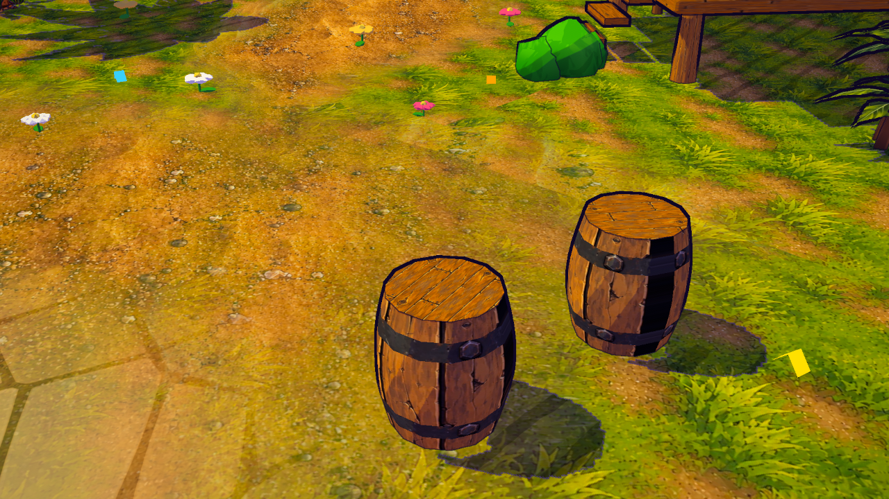
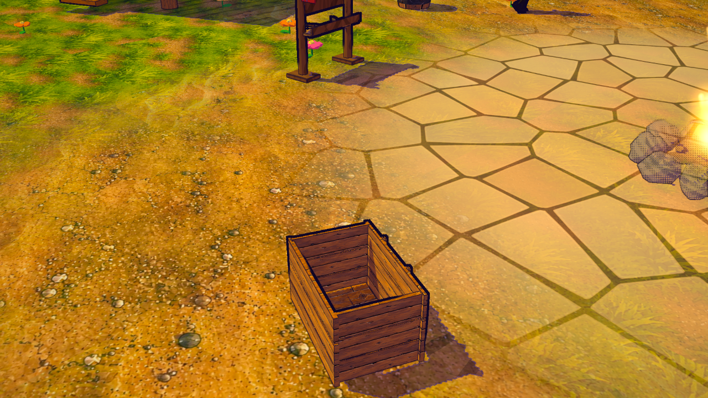

# S17 — barriles y cajas con madera ilustrada

2026-10-08. Integración local sobre los props existentes del pueblo y La Caldera: ocho barriles
cerrados con duelas verticales, dos aros y remaches pintados; siete cajas Dreamrise abiertas con
veta horizontal e interior conservado. Las ubicaciones, escalas y colisiones siguen siendo las
del mapa. La caja procedural de respaldo recibe el mismo acabado cuando el GLB falta.

## Recursos y alcance

Se reutiliza `prop:storage-crate`, GLB A02 de 51.684 B y 204 triángulos. Su geometría se clona
solo para estas instancias estáticas; el registro conserva el modelo, la paleta y sus recursos
para la balsa y otros consumidores. Los barriles nativos conservan su geometría torneada.
`portCargo.js` cambia las UV y máscaras antes del bake; no modifica posiciones, normales,
índices ni matrices. Los aros seleccionan triángulos completos y un recorte del hierro S14;
el remache está pintado, sin añadir geometría. Flotantes y cajas de balsa quedan fuera.

Cruce Unreal acotado registrado en el [brief](../briefs/visual-s17-port-cargo.md): paquete
Dreamrise `SM_StoragePart_03` verificado, 24.248 B. Dos nombres Kobo de barril están presentes
en MyProject (3.846.208 y 4.433.034 B), pero su clase, geometría y dependencias/exportación
no están verificadas. No se exportan ni se cambia ningún proyecto fuente.

Los atlas del pueblo ya cargados se comparten: color sRGB y normal lineal, fuerza 0,18;
2048² PC / 1024² táctil. El par existente pesa 3.413.690 B PC / 946.086 B táctil. S17 añade
cero texturas, descargas, mallas o pasadas. En la escena hay 28 mallas y 46.194 triángulos de
geometría única antes/después; contando las siete instancias de caja, 47.418 triángulos
potenciales en props. No equivale a una medición de todo el renderer ni de sus pasadas.

Los buffers usados por props aumentan 6.528 B (máscaras de 408 vértices del modelo).
La copia completa de geometría ocupa 27.336 B: 26.112 B de atributos y 1.224 B de índices;
la fuente original permanece en el registro. No se infiere VRAM total ni FPS de estos números.
Los chunks nativos ya tenían UV/máscaras de S14/S15 y mantienen su tamaño.

## Validación

**122/122 pruebas visuales seleccionadas pasan**, incluidas cuatro nuevas. Las cuatro
pruebas nuevas verifican triángulos dentro de un sector, costura angular, dirección de veta,
geometría/índices y propiedad de recursos, transformaciones y respaldo cuando falta el atlas
de color, sin alterar mapa/RNG. El respaldo por GLB ausente se verificó en navegador.

QA del principal, serial: tres comparaciones antes/después en escritorio, móvil y low;
nueve contextos finales (estos tres, noche, noassets, color ausente, normal ausente, GLB ausente
y vertical rotado). Tres vistas por caso, 36 capturas. Los 36 cambios de calidad finales
`high → low → medium → high` conservan geometría/material/atlas y GL=0, programas enlazados,
sin errores JS de página/juego. Los únicos errores de recursos finales son los 404 inducidos;
algunos contextos registran además el favicon opcional ausente.

Las comparaciones verifican por SHA-256 posiciones/normales/atributos restantes, índices,
matrices de instancia, transformaciones y sombras; solo cambian UV/máscara de los chunks
con barriles y UV/máscaras/programa de la caja. Banderas animadas excluyen únicamente sus
atributos y matriz cambiantes. Las cámaras y props del mapa coinciden exactamente.
Se verificaron las URLs, resoluciones y espacios de color realmente cargados, con una variante
por dispositivo. Noassets no solicita estos recursos. Sin color vuelve la pintura anterior;
sin normal conserva el nuevo color; sin GLB usa la caja procedural pintada.

Capturas inspeccionadas de escritorio/móvil/low/noche/fallos/vertical. La vista general
incluye el HUD de misión del teletransporte; algún NPC tapa parcialmente un barril de noche.
Durante QA apareció `route is not defined` en trabajo naval paralelo; el escritor de esa
parte corrigió la variable en el checkout compartido. Se repitieron todos los casos afectados
y dos pruebas de recuperación naval pasan. S17 no modifica código naval ni migraciones.
Algunos arranques demorados excedieron el timeout; sus intentos no cuentan como aceptación.

## Registro y límites

Se actualizan las filas existentes `barril` y `crate-integrada`, conservando sus documentos,
modelo y evidencia A02. Las ocho fuentes exactas de este corte se congelan en
`docs/art/source/port-cargo-v1/final/source-snapshot.json`, con hashes de los cinco recursos
reutilizados. El registro valida runtime/fuentes y usa CAS; la comprobación HTTP compara bytes.
Las copias previas y demás trabajo compartido se conservan.

Registro comprobado: revisión 31, 104 filas / 48 aplicadas; las otras 102 filas conservan
exactamente sus datos previos. **58 enlaces HTTP coinciden por SHA-256** con sus archivos locales.
Las dos fichas se abrieron sin guardar cambios: Barril, 40 imágenes / 96 enlaces; Caja de carga
integrada, 41 imágenes / 99 enlaces. Todas las imágenes decodifican y no hubo errores JS.
[Ficha de barril](../art/port-cargo/catalog-barril-v1.png) y
[ficha de caja](../art/port-cargo/catalog-crate-integrada-v1.png), inspeccionadas por el principal.
Los enlaces de las fichas incluyen las imágenes; los 58 archivos HTTP son rutas únicas.
[Resultado de revisión del catálogo](../art/port-cargo/catalog-ui-evidence-v1.json).

Variantes de barril abierto/claro/oscuro, material metálico con respuesta propia, objetos de
almacenamiento funcional, arte fino y FPS en dispositivos físicos pendientes. Sin publicación.
Siguiente pieza visual sugerida: faroles y señalización del pueblo.
