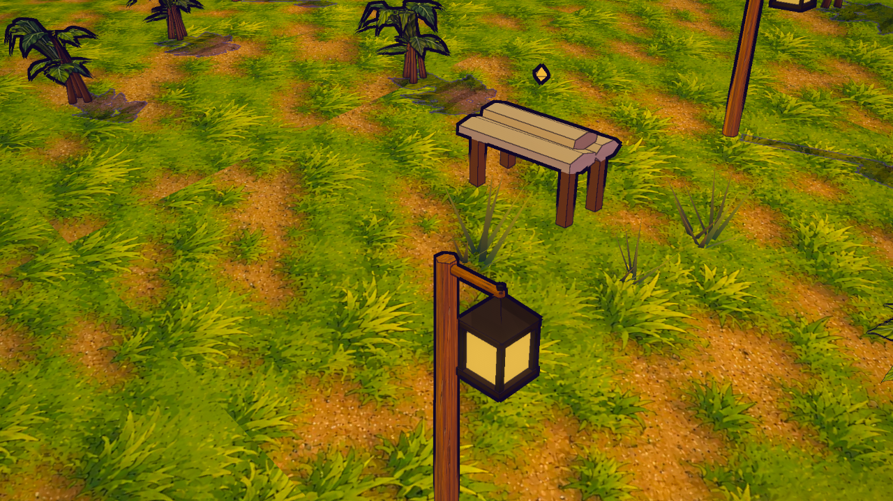
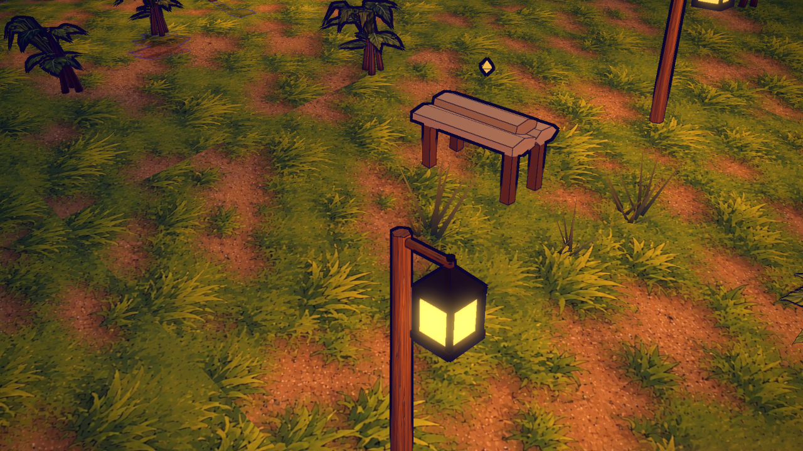
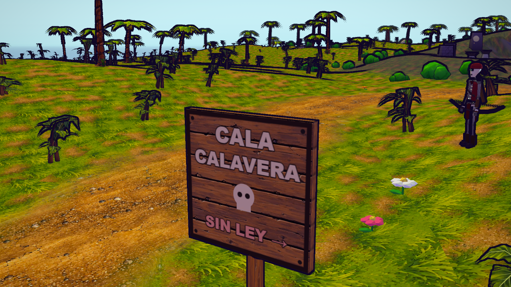

# S18 — faroles y letreros con madera ilustrada

2026-10-08. Ocho faroles existentes reciben madera del pueblo y jaula oscura alrededor del vidrio.
Los dos letreros conservan sus destinos/flechas, con tablones horizontales y letras más legibles.
El poste queda detrás de la cara escrita; el reverso queda sin letras. Integración local, sin publicación.

## Aplicación y presupuesto

`townFixtures.js` construye los elementos nativos y una variante toon para letras sobre el atlas
existente. El cruce acotado Unreal y la decisión de reutilización están en el [brief](../briefs/visual-s18-town-fixtures.md).
La antorcha Dreamrise verificada no aporta una jaula de farol; no se exporta ni se toca el proyecto fuente.

Color sRGB y normal lineal S14, fuerza 0,18, compartidos con el pueblo: 2048² PC / 1024² táctil,
3.413.690 B / 946.086 B para el par ya existente. Dos canvas de letras 256² reemplazan los dos
canvas anteriores de letreros: mismo número/resolución, cero archivos descargados nuevos.
Las barras son opacas y se fusionan en los chunks existentes; se conserva el vidrio y su emisión.
No se añaden fuentes de luz, parpadeo, sombras dinámicas de lámpara ni pasadas.

Con recursos cargados, props mantiene 28 mallas (27 en noassets, al fusionar la caja procedural
de respaldo en lugar de instanciar el GLB). Geometría única 46.194 → 46.834 triángulos: +640, 80 por farol;
con las siete instancias de caja, 47.418 → 48.058 triángulos potenciales. Buffers de atributos/índices
de esas mallas 7.344.608 → 7.462.448 B, +117.840 B; no es VRAM total ni FPS. El poste y la
jaula conservan los bounds del farol. Los tablones siguen midiendo 1,5 × 1,1/1,45 × 0,1, con
12 triángulos y desplazamiento visual local Z +0,16. Las posiciones/rotaciones/escalas del mapa,
colisiones y fuentes de iluminación coinciden exactamente antes/después. No cambia gameplay.

Sin albedo vuelve la geometría/color anterior y los letreros canvas originales; sin normal
se conserva la pintura nueva. En la prueba de color ausente el registro sí carga el normal
existente del manifiesto, pero estos consumidores no lo enlazan ni lo muestrean.

## Validación local

**127/127 pruebas visuales seleccionadas**, cinco nuevas de geometría, bounds, UV, texto frontal,
material/normal compartidos e integración sin RNG. [Log](../art/town-fixtures/tests-v1.log).
Una comparación PC previa y ocho contextos finales PC/móvil/low/noche/noassets/color ausente/
normal ausente/vertical rotado, cuatro vistas por caso: **36 capturas y 32 cambios de calidad
finales**, recursos conservados, GL=0, programas enlazados y cero errores JS de página/juego.
Solo favicon opcional y los dos fallos 404 inducidos. URLs/resoluciones reales y espacios de
color comprobados; una variante por dispositivo. [Evidencia](../art/town-fixtures/runtime-evidence-v1.json).

El principal inspeccionó las vistas de día/noche, ambas señales, móvil, low, respaldo sin color
y vertical. Caldera queda parcialmente tras una cabaña con su tramado de oclusión; se conserva
esa colocación. El encuadre de detalle fuerza las luces cercanas a su foco para fotografiar el
farol; usa el selector existente, sin cambiar luces de gameplay. La vista general lleva el HUD
de misión del teletransporte; vertical usa la rotación automática existente. No son pruebas
de controles o rendimiento físico. La comparación excluye los atributos de banderas animadas.

## Registro y continuidad

Dos fichas individuales `farol-pintado-v1` y `letreros-pintados-v1`, con cuatro atlas reutilizados,
capturas, código/pruebas/QA congelados y recibo SHA-256. Se conservan las 104 filas anteriores,
incluido el conjunto `cuerda-mostrador-farol`, que sigue pendiente como composición conjunta.
Siete fuentes en `docs/art/source/town-fixtures-v1/final-v2/source-snapshot.json`. El primer
recibo `final/` se conserva como diagnóstico: su validador asumía una malla de caja importada
también en noassets y rechazó correctamente el registro antes de escribirlo.

Catálogo revisión **32, 106 filas / 50 aplicadas**; las 104 anteriores conservan exactamente sus
datos, con CAS e idempotencia. **53 archivos HTTP coinciden por SHA-256** con las copias locales.
Ambas fichas se abrieron sin guardar: 40 imágenes / 98 enlaces cada una, todas decodificadas,
sin errores JS. [Farol](../art/town-fixtures/catalog-farol-pintado-v1-v1.png),
[letreros](../art/town-fixtures/catalog-letreros-pintados-v1-v1.png) y
[revisión del principal](../art/town-fixtures/catalog-ui-evidence-v1.json). Los enlaces de las
fichas incluyen imágenes; el conteo HTTP corresponde a rutas únicas. Transformaciones, sombras,
geometría/índices/matrices/programas de otros props estáticos, cámaras de comparación y vidrio
diurno conservados; banderas animadas excluidas de comparación estática.

Arte fino, FPS físicos y publicación pendientes. Siguiente propuesta visual: banco de trabajo
y mobiliario del puesto.
Naval/M5/chat/agentes/Web3/personajes mantienen sus continuidades.
