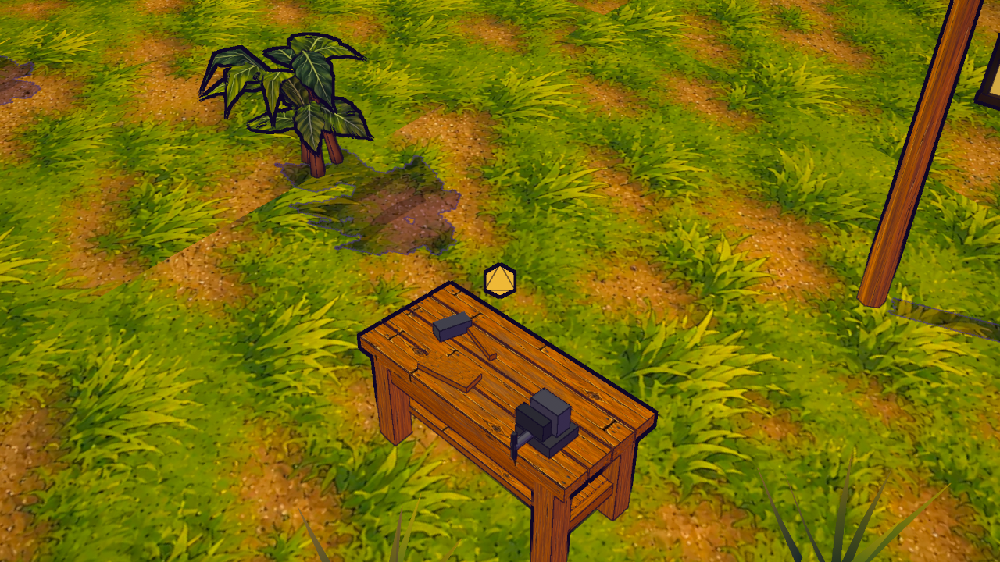
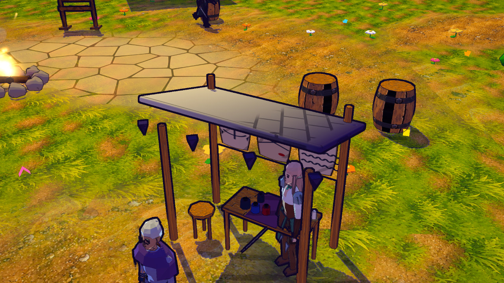

# S19 — muebles de pueblo con madera ilustrada

2026-10-08. Implementado y comprobado localmente; sin publicación.

## Resultado y presupuesto

El banco de recursos tiene cuatro tablones, patas/refuerzos, repisa, tornillo de banco,
martillo y recorte de madera. Comparte el atlas town-wood S14 con casas y muebles;
metal conserva su color geométrico. Los postes, mesa, taburete y caja de agujas del puesto
de Doña Sepia reciben la misma madera, conservando su tela, frascos, vela y pieles.

El banco pasa de seis mallas (tablero, cuatro patas y gema) a dos (cuerpo y gema).
El cuerpo tiene **276 triángulos**; con gema son **284**, frente a **188** anteriores:
**+96 triángulos dibujables y cuatro mallas menos**, sin sombras proyectadas nuevas.
El nuevo cuerpo sí recibe sombras. No prueba FPS ni draw calls totales de los pases del renderer.
La forma compacta mide aproximadamente 1,48 × 0,97 × 0,719 u; no añade colisiones.

El grupo estático de props conserva **28 mallas, 46.834 triángulos de geometría por malla**
(sin multiplicar las siete cajas instanciadas) y **7.462.448 B** de atributos/índices.
Las sumas por malla del banco son 12.840 → 40.512 B; el valor previo repite cuatro veces
la misma geometría compartida de pata. El cuerpo nuevo contiene 39.744 B de atributos,
no una medición de VRAM. [Comparación independiente](../art/town-furniture/geometry-review-v1.json).

Cero descargas o texturas nuevas: los atlas existentes mantienen **2048² PC / 1024² táctil**,
color sRGB, normal lineal **0,18**. Sin color se conservan las seis mallas del banco anterior;
sin normal se mantiene el nuevo color. En color ausente el registro carga el normal existente,
pero el banco y los muebles no lo enlazan ni lo muestrean. La variante noassets conserva
las tablas nativas S09; difiere de la tabla importada cuando los assets sí cargan, como antes.

## Evidencia y límites

**147/147 pruebas seleccionadas**, cinco nuevas para presupuesto/UV, material, integración,
ancla/visibilidad, actualización y respaldo, más regresión visual y crafting/recolección.
[Log](../art/town-furniture/tests-v1.log). La comparación de geometría del puesto usa un mapa
aislado sin RNG; no cambia ni acepta balance o recetas nuevas.

[Recibo runtime](../art/town-furniture/runtime-evidence-v1.json): un PC previo y siete finales
PC/móvil/low/noassets/color ausente/normal ausente/vertical, tres vistas por caso:
**24 capturas y 28 cambios de calidad finales**, atlas/material/geometría estables.
Una variante real por dispositivo, cero errores JS/GL, programas enlazados; sólo favicon opcional
y los dos 404 inducidos. El principal inspeccionó banco/puesto PC, banco móvil, puesto low,
respaldo sin assets, normal ausente y panorámica vertical. Cámaras PC y 26 mallas estáticas
conservan posiciones/normales/colores/índices/matrices/sombras/programas; UV/máscara de madera
del chunk de Sepia sí cambia. Banderas animadas excluidas de comparación estática.

Fotografía con teletransporte al banco, pausa, reloj de material fijo, oclusión cercana
desactivada y encuadre dedicado; luces cercanas usan el selector existente. La panorámica
incluye el HUD de la misión provocado por el teletransporte. Vertical usa la rotación automática
existente; no es aceptación de controles ni GPU/teléfono físicos. El banco mantiene la gema,
ancla y distancia de visibilidad originales. No cambia mapa, colisiones, RNG, perfiles,
protocolo, SQL, crafting, permisos o publicación.

## Registro y continuidad

Dos fichas individuales: `banco-carpintero-v1` y `mobiliario-sepia-v1`, con cuatro atlas reutilizados,
nueve fuentes congeladas y SHA-256, capturas, brief y log. Las 106 filas previas se conservan.
Herramientas: `prepare-town-furniture-sources.mjs [--check]` y
`register-town-furniture-catalog.mjs [--validate-runtime|--verify-only]`, con CAS e idempotencia.
Recibo: `docs/art/source/town-furniture-v1/final/source-snapshot.json`.

Catálogo revisión **33, 108 filas / 52 aplicadas**; las 106 anteriores coinciden con el catálogo
previo inmutable. **43 rutas HTTP** verificadas por SHA-256. Ambas fichas abiertas sin guardar,
**28 imágenes / 76 enlaces** por ficha, sin fallos de decodificación ni JS.
[Revisión de interfaz](../art/town-furniture/catalog-ui-evidence-v1.json),
[banco](../art/town-furniture/catalog-banco-carpintero-v1-v1.png) y
[Doña Sepia](../art/town-furniture/catalog-mobiliario-sepia-v1-v1.png).

La auditoría Unreal y su decisión se registran en el [brief](../briefs/visual-s19-town-furniture.md).
El banco RepairBench queda candidato pendiente de exportación, sin modificar fuentes Unreal.
Este mobiliario es una pieza del futuro Salty Shore: la carpintería comunitaria, sus tres
estados de obra y la nueva composición urbana A0/A1 siguen pendientes. Próximo corte propuesto:
jerarquía de plaza/capitanía y kit de obra, con las anclas funcionales coordinadas antes de mover props.
Naval, M5, chat/agentes, Web3 y personajes conservan su continuidad.
