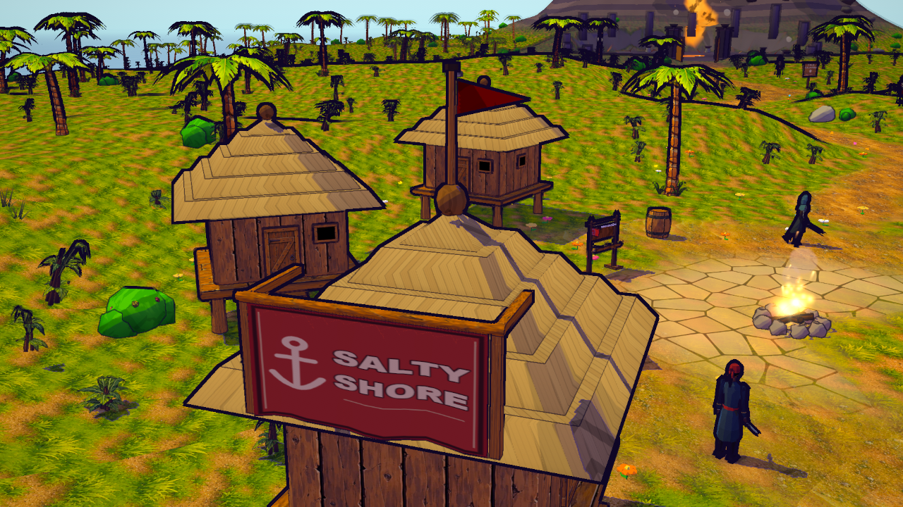
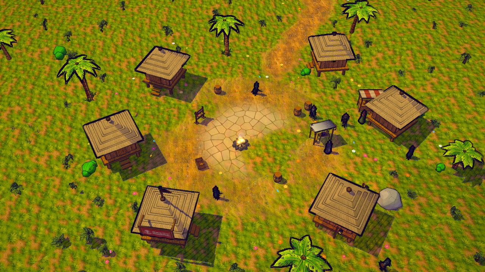

# S20 — fachada de Salty Shore aplicada localmente

Una casa existente orientada al puerto lleva una tela roja con ancla y nombre, marco de madera
y mástil corto. El lateral del tejado permite leer el rótulo desde la cámara habitual. La entrada,
escaleras y ventanas conservan su forma; la tela y el banderín son estáticos.

## Implementación y presupuesto

`src/render/townHall.js` selecciona por distancia y orientación hacia el muelle, sin RNG ni mutación.
`createProps` incorpora los soportes al chunk existente y añade una malla `townHallBanner` con sombra.
La textura del rótulo es un canvas sRGB 256×256 creado una vez al montar props, opaco y toon de doble
cara, sin normal map. 262.144 B de píxeles RGBA antes de mipmaps es una estimación, no VRAM medida.
No cambia la política de calidad ni añade trabajo de generación por frame.

| Medida del grupo props, semilla 99282957 | Antes | Después |
|---|---:|---:|
| Mallas | 28 | 29 |
| Triángulos de geometría por malla | 46.834 | 47.052 |
| Buffers de atributos/índices por malla | 7.462.448 B | 7.490.824 B |

Incremento: **218 triángulos y 28.376 B** en buffers. 146 triángulos de soportes, 72 de tela.
El recuento no expande las siete instancias de cajas preexistentes; una malla participa en las
pasadas existentes de imagen, normales y sombra. Sin nueva luz ni pasada de pipeline. No prueba FPS.
Límite local de altura del adorno: 3,345–7,24 u; todo por encima de la puerta. En la semilla de QA,
hut `{x:69,2965; y:2,4218; z:89,0955; rot:2,2; scale:1}`, sin moverla.

Atlas S14 compartidos, normal lineal con fuerza 0,18 y color sRGB: una pareja real 2048² en PC o
1024² en móvil. Cero archivos/texturas nuevas descargadas. Sólo el canvas del rótulo añade una textura
en memoria. Sin color o con hut importada se omite el adorno; sin normal se conserva su color.

## Verificación local

**152/152 pruebas pertinentes**, cinco nuevas y 147 de regresión de arte, recursos y loop seleccionado.
[Log](../art/town-hall/tests-v1.log). La revisión del principal corrigió las fixtures de respaldo para que
la hut fuera elegible y congeló también el mapa de integración. No hay lectura de RNG en renderer.

[Evidencia runtime](../art/town-hall/runtime-evidence-v1.json): un PC previo y siete contextos finales
PC/móvil/low/noassets/color ausente/normal ausente/vertical; **24 capturas y 28 cambios finales de calidad**.
Los parámetros device/phase se inyectan explícitamente al ejecutar el script de fotografía, que abre y
cierra cada contexto secuencialmente. Geometría/material/canvas/atlas conservan su identidad entre tiers.
Cero errores JS de juego, GL=0 y programas enlazados; sólo favicon opcional y dos 404 inducidos.

[Comparación independiente](../art/town-hall/geometry-review-v1.json): **25 mallas estáticas intactas**,
un chunk ampliado y una tela nueva. Cámaras PC equivalentes; animaciones anteriores excluidas del hash.
Props, landmarks, muelle, NPC, colliders y recursos coinciden por hash en los ocho contextos.
El principal inspeccionó PC detalle/panorámica, móvil, low, normal ausente y vertical emulado.

Fotografía con teletransporte al banco, pausa, tiempo de shader fijo, UI oculta, oclusión cercana
desactivada y encuadres dedicados. `arrival` es un acercamiento al edificio, no una prueba de caminar
desde spawn. Vertical conserva la rotación automática existente. No acredita controles ni GPU/teléfono
físicos. Capitana Brea sigue en su ancla: este corte no convierte la casa en una nueva interacción.

## Catálogo y continuidad

Ficha `fachada-salty-shore-v1`, con cuatro atlas reutilizados, siete fuentes congeladas, SHA-256,
catálogo previo, capturas, geometría, brief y log. Recibo:
`docs/art/source/town-hall-v1/final/source-snapshot.json`. Herramientas:
`prepare-town-hall-sources.mjs [--check]` y `register-town-hall-catalog.mjs [--validate-runtime|--verify-only]`.
Registro con CAS e idempotencia, preservando las 108 filas anteriores.

Catálogo revisión **34, 109 filas / 53 aplicadas**. **42 rutas HTTP** coinciden por SHA-256.
Ficha abierta sin guardar: **28 imágenes / 76 enlaces**, todas decodificadas y sin errores JS.
[Recibo de interfaz](../art/town-hall/catalog-ui-evidence-v1.json) y
[captura de la ficha](../art/town-hall/catalog-fachada-salty-shore-v1-v1.png).

El [brief](../briefs/visual-s20-town-hall.md) registra la auditoría Unreal y decisión de reutilización.
No se alteran sim, mapa, RNG, perfiles, protocolo, SQL, crafting, permisos o publicación.
El nombre runtime Aldea Coralina sigue vigente; Salty Shore es la dirección visual del alfa.

Siguiente corte propuesto: kit de obra junto a carpintería, con ancla y huella acordadas en A0 y
variantes visuales de acopio/cimientos/andamio. El estado comunitario/aprendizaje durable A1 necesita
su contrato mecánico antes de conectarse. Naval, M5, chat/agentes, Web3 y personajes conservan su cola.
